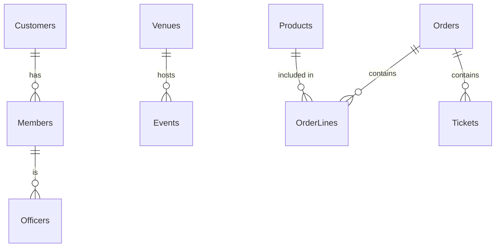
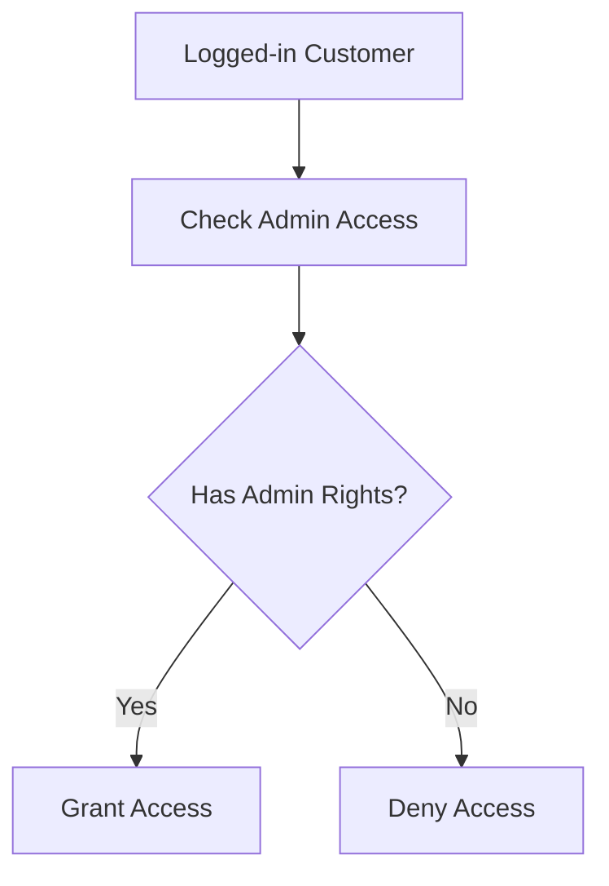

# Cyber Cougars Club Order & Event System (CCOS)  

Database Schema (SQL Server / Azure SQL)

---



Customers: base identity for anyone who can place an order  
(guests and members both live here)

```mermaid

CREATE TABLE Customers (  
    CustomerId INT IDENTITY(1,1) PRIMARY KEY,  
    FirstName NVARCHAR(50) NOT NULL,  
    LastName NVARCHAR(50) NOT NULL,  
    Email NVARCHAR(100) NOT NULL UNIQUE,  
    CreatedAt DATETIME2 NOT NULL DEFAULT SYSUTCDATETIME()  
);
```

 Members: optional 1-to-1 extension of Customer.  
 MemberId is BOTH the PK and the FK back to Customers,  
 so a Customer either has a matching Member row or doesn't.  
 A Member is a Customer, but not all Customers are Members.

```mermaid

CREATE TABLE Members (  
    MemberId INT PRIMARY KEY,  
    DuesPaidThrough DATE NOT NULL,  
    IsCurrent AS (CASE WHEN DuesPaidThrough \>= CAST(GETDATE() AS DATE)  
        THEN CAST(1 AS BIT) ELSE CAST(0 AS BIT) END) PERSISTED,  
    CONSTRAINT FK\_Members\_Customers FOREIGN KEY (MemberId)  
        REFERENCES Customers(CustomerId) ON DELETE CASCADE  
);
```

 Officers: optional 1-to-1 extension of Member.  
 Only current members can be officers; this table is what  
 grants admin access to the app (checked at login/authorization).  

```mermaid

CREATE TABLE Officers (  
    OfficerId INT PRIMARY KEY,  
    Title NVARCHAR(50) NULL, \-- e.g. President, VP of Grit, Social Media Coordinator  
    GrantedDate DATE NOT NULL DEFAULT CAST(GETDATE() AS DATE),  
    CONSTRAINT FK\_Officers\_Members FOREIGN KEY (OfficerId)  
        REFERENCES Members(MemberId) ON DELETE CASCADE  
);
```

 Products: swag / resource items available to order  

```mermaid

CREATE TABLE Products (  
    ProductId INT IDENTITY(1,1) PRIMARY KEY,  
    Category NVARCHAR(30) NOT NULL, \-- e.g. 'Swag', 'Resources'  
    Name NVARCHAR(100) NOT NULL,  
    Description NVARCHAR(500) NULL,  
    Price DECIMAL(10,2) NOT NULL CHECK (Price \>= 0),  
    MemberPrice DECIMAL(10,2) NOT NULL CHECK (MemberPrice \>= 0),  
    StockQuantity INT NOT NULL CHECK (StockQuantity \>= 0),  
    IsActive BIT NOT NULL DEFAULT 1  
);
```

 Venues: locations where events are held

```mermaid

CREATE TABLE Venues (  
    VenueId INT IDENTITY(1,1) PRIMARY KEY,  
    Name NVARCHAR(100) NOT NULL,  
    Address NVARCHAR(200) NOT NULL,  
    Capacity INT NOT NULL CHECK (Capacity \> 0\)  
);
```

 Events: club events, each hosted at one venue  

```mermaid

CREATE TABLE Events (  
    EventId INT IDENTITY(1,1) PRIMARY KEY,  
    VenueId INT NOT NULL,  
    Name NVARCHAR(100) NOT NULL,  
    Description NVARCHAR(500) NULL,  
    EventDateTime DATETIME2 NOT NULL,  
    TicketCapacity INT NOT NULL CHECK (TicketCapacity \> 0),  
    MembersOnly BIT NOT NULL DEFAULT 0,  
    Price DECIMAL(10,2) NOT NULL CHECK (Price \>= 0),  
    MemberPrice DECIMAL(10,2) NOT NULL CHECK (MemberPrice \>= 0),  
    CONSTRAINT FK\_Events\_Venues FOREIGN KEY (VenueId)  
        REFERENCES Venues(VenueId)  
);
```

 Orders: order header, one per checkout  

```mermaid

CREATE TABLE Orders (  
    OrderId INT IDENTITY(1,1) PRIMARY KEY,  
    CustomerId INT NOT NULL,  
    OrderDate DATETIME2 NOT NULL DEFAULT SYSUTCDATETIME(),  
    Status NVARCHAR(20) NOT NULL DEFAULT 'Pending'  
        CHECK (Status IN ('Pending', 'Fulfilled', 'Canceled')),  
    TotalAmount DECIMAL(10,2) NOT NULL CHECK (TotalAmount \>= 0),  
    CONSTRAINT FK\_Orders\_Customers FOREIGN KEY (CustomerId)  
        REFERENCES Customers(CustomerId)  
);
```

 \-- OrderLines: bridge table for Order \<-\> Product (many-to-many)

```mermaid

CREATE TABLE OrderLines (  
    OrderLineId INT IDENTITY(1,1) PRIMARY KEY,  
    OrderId INT NOT NULL,  
    ProductId INT NOT NULL,  
    Quantity INT NOT NULL CHECK (Quantity \> 0),  
    UnitPrice DECIMAL(10,2) NOT NULL CHECK (UnitPrice \>= 0), \-- price snapshot at time of order  
    CONSTRAINT FK\_OrderLines\_Orders FOREIGN KEY (OrderId)  
        REFERENCES Orders(OrderId) ON DELETE CASCADE,  
    CONSTRAINT FK\_OrderLines\_Products FOREIGN KEY (ProductId)  
        REFERENCES Products(ProductId)  
);
```

 Tickets: one row per event admission purchased on an order  

 ```mermaid

CREATE TABLE Tickets (  
    TicketId INT IDENTITY(1,1) PRIMARY KEY,  
    OrderId INT NOT NULL,  
    EventId INT NOT NULL,  
    PriceCharged DECIMAL(10,2) NOT NULL CHECK (PriceCharged \>= 0), \-- price snapshot  
    Status NVARCHAR(20) NOT NULL DEFAULT 'Purchased'  
        CHECK (Status IN ('Reserved', 'Purchased', 'Canceled')),  
    CONSTRAINT FK\_Tickets\_Orders FOREIGN KEY (OrderId)  
        REFERENCES Orders(OrderId) ON DELETE CASCADE,  
    CONSTRAINT FK\_Tickets\_Events FOREIGN KEY (EventId)  
        REFERENCES Events(EventId)  
);
```

\---------------------------------------------------------  
Helpful indexes for common lookups  
\---------------------------------------------------------

```mermaid

CREATE INDEX IX\_Orders\_CustomerId       ON Orders(CustomerId);  
CREATE INDEX IX\_OrderLines\_OrderId      ON OrderLines(OrderId);  
CREATE INDEX IX\_OrderLines\_ProductId    ON OrderLines(ProductId);  
CREATE INDEX IX\_Tickets\_OrderId         ON Tickets(OrderId);  
CREATE INDEX IX\_Tickets\_EventId         ON Tickets(EventId);  
CREATE INDEX IX\_Events\_VenueId          ON Events(VenueId);
```

\---------------------------------------------------------  
Example: checking whether a logged-in customer has admin access  
\---------------------------------------------------------  



```mermaid

SELECT o.OfficerId  
FROM Officers o  
WHERE o.OfficerId \= @CustomerId; \-- a match \= admin access
```

\---------------------------------------------------------  
Example: how a ticket's sold count vs. capacity gets checked  
(used in the "sold out" validation before inserting a Ticket)  
\---------------------------------------------------------  

```mermaid

SELECT COUNT(\*) AS TicketsSold  
FROM Tickets  
WHERE EventId \= @EventId AND Status \<\> 'Canceled';  
```
